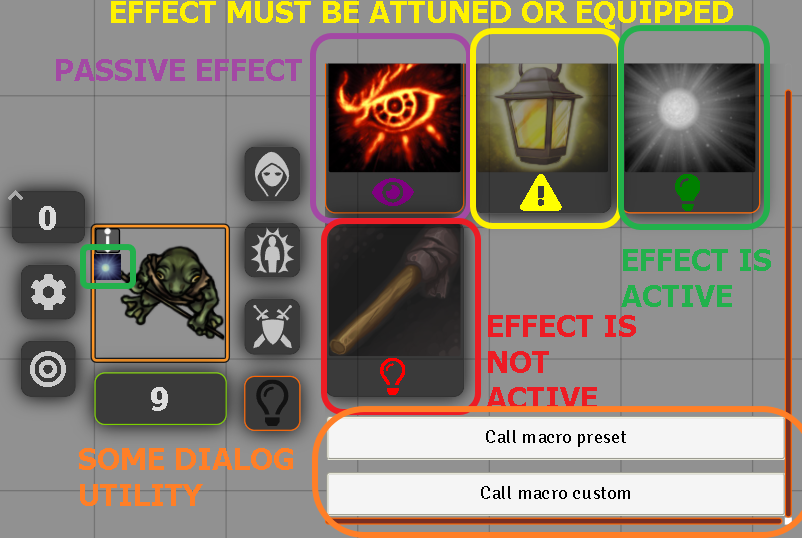
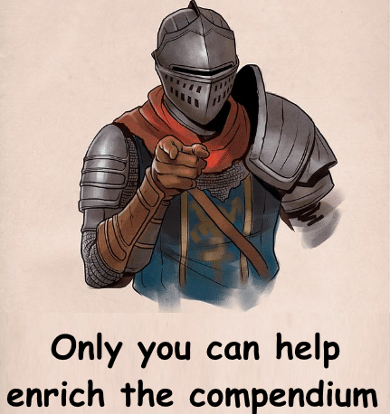

# LightHUD+ATE

 

[](https://forge-vtt.com/bazaar#package=lights-hud-ate) 


[](https://www.foundryvtt-hub.com/package/lights-hud-ate/)


[](https://weblate.foundryvtt-hub.com/engage/lights-hud-ate/)

### If you want to buy me a coffee [](https://www.patreon.com/p4535992)


This project is born like a fusion of the features of these modules [LightsHUD](https://github.com/Malekal4699/LightsHUD/), [ATE](https://github.com/kandashi/Active-Token-Lighting) and [DFreds Convenient Effects](https://github.com/DFreds/dfreds-convenient-effects), but after the initial code i rewriting everything so many times now is just a new module inspired form these other modules.

Remember to support these authors if you feel generous on their patreon or kofi account.

A Foundry VTT module that displays on the HUD config of the token all the available lighting and visions items on the token/actor with two modality:

1) The module setting **'Apply HUD interface on ATE Items' (by default is true)** enable some [ATE](https://github.com/kandashi/Active-Token-Lighting) effect, so you can light a torch or turn of without modify the token configuration and you can set with [Times up](https://gitlab.com/tposney/times-up) and [Dae](https://gitlab.com/tposney/dae) time and condition of the vision and light effect on the token.


2) The module setting **'Apply HUD interface on flagged Items' (by default is false)** enable some old flag system for replicate the old behavior of LightsHUD, but with a more dynamic and customizable integration or for people who don't like [ATE](https://github.com/kandashi/Active-Token-Lighting) and want a minimal setup starting from a series of presets.


3) The module setting **'Enable LightHUD Old Interface' (by default is false)** fFor people who want the literally 1:1 same interface of the old LightsHUD you can enable this. Usually this will work better with 'Apply HUD interface on ATE Items' and 'Apply HUD interface on flagged Items' module setting disabled, but they can kind work together


## NOTES:

**Although not recommended, both modes can be active** and the interface will show both ATE effect and item objects with module flags activated. The priority of the light and visual effects will always be given to the ATE effects present on the object if there are both the ATE effects and the module flags.

**If both settings are disabled** only the two GM management macros will be viewable on the HUD interface, it can be useful for very minimal games without too many gadgets.

**Which of the two settings should I choose?**
If you are experienced enough with active effects I suggest you use the solution with ATE because under the hood it does a lot of cool things that you can't even imagine.

If you ask me the big difference is that the version with flags has the limitation of not "merging" the abilities, but of overriding to keep active one effect at a time, while ATE does the "merge" trying to give the "best of the bunch".

## What are the differences between LightHUD, DFreds Convenient Effects and LightHUD + ATE?

The module "LightHUD" is more _generic_, not in the wrong sense of the term, but there are simply cases where you want to create custom animations for your torches and lanterns and do not been vincolate 

The module "DFreds Convenient Effects" it lets you add effects related to ligthing and always customize them with ATE, but it is not bound to the objects currently present in the actor and does not take into account things such as limitation of use and consumption of objects.

## NOTE: If you are a javascript developer and not a typescript developer, you can just use the javascript files under the dist folder

## Installation

It's always easiest to install modules from the in game add-on browser.

To install this module manually:
1.  Inside the Foundry "Configuration and Setup" screen, click "Add-on Modules"
2.  Click "Install Module"
3.  In the "Manifest URL" field, paste the following url:
`https://raw.githubusercontent.com/p4535992/foundryvtt-lights-hud-ate-new/master/src/module.json`
4.  Click 'Install' and wait for installation to complete
5.  Don't forget to enable the module in game using the "Manage Module" button

### libWrapper

This module uses the [libWrapper](https://github.com/ruipin/fvtt-lib-wrapper) library for wrapping core methods. It is a hard dependency and it is recommended for the best experience and compatibility with other modules.

### socketlib

This module uses the [socketlib](https://github.com/manuelVo/foundryvtt-socketlib) library for wrapping socket methods. It is a hard dependency and it is recommended for the best experience and compatibility with other modules.

### ATE (old ATL)

This module uses the [ATE](https://github.com/kandashi/Active-Token-Lighting) library for wrapping methods. It is a hard dependency and it is recommended for the best experience and compatibility with other modules.

### Warpgate

This module uses the [warpgate](https://github.com/trioderegion/warpgate) library for wrapping methods. It is a hard dependency and it is recommended for the best experience and compatibility with other modules.

## Known Issue\Limitation

- Internazionalization of the labels (is coming after the bug fixing...)
- **HELP WANTED** This is just a "fast to make" module maybe someone a little more expert than me with form application and hud layer can do a better form for a better user experience
- [CommunityLighting](https://github.com/BlitzKraig/fvtt-CommunityLighting) is not been updated for foundryvtt 9 so is not advisable to used right now.
- The modules is not smart enough to distinct multiple ligthing effect on the same item and is not make sense ? Every item must have only one effect with _ATL changes_ on it (at least for me). If multiple effect with _ATL changes_ are founded on the same item only the first is analyzed from the module, you can use multiple item where each has is own lighting configuration.
- The [warpgate](https://github.com/trioderegion/warpgate) function `spawnAt` should include a check distance of  spawn so no player drop torch on a very far point of the canvas.
- The properties _height,width,scale,_ can be modififed only with the ATL integration for my sanity
- Some system like pf2e not support active effects...

## Supported Systems

- [Dnd5e](https://gitlab.com/foundrynet/dnd5e)
- [Pathfinder 2e](https://foundryvtt.com/packages/pf2e)

**How can i add my system ?** That's is pretty easy on the code level ty to the design pattern so i just need some information on the system rules and voilà.

## Feature

### Add a custom ATE Effect for customize vision and lighting on my game

This is already done from the [ATE](https://github.com/kandashi/Active-Token-Lighting) checkout the documentation on that module.

### Add vision and lighting modification with ATE active effect (the advisable way)

Add vision and lighting modification with ATE active effect, no token configuration is actually touched, everything is on the active effect management, the duration the remove, the adding, you can even merge the effect of two different kind of visions and lighting together.

The module is build to show on a left click of the button with the image of a lightBulb on the hud panel all the item with some ATL effect present on the token\actor, there is a distinction between passive, temporary, applied, need to be attuned or equipped condition (suppressed).



| Symbol | Description  |
|:----:|:----:|
| | The symbol of the **yellow exclamation triangle** means the active effect is _suppressed_ for some reason that you can delve into in the effects panel, usually _need to be attuned or equipped condition_ this does not prevent the effect from being active or not, only that it will result in the subcategory of inactive effects. |
| | The symbol of the **light blue infinity** means the active effect is _passive_ like a race feature or a special ability like _darkvision_, this does not prevent the effect from being active or not, only that it will result in the subcategory of inactive effects. |
| | The symbol of the **white clock** means the active effect is _temporary_ like a spell valid only for tot. rounds or seconds, this is usually managed from the [Times up](https://gitlab.com/tposney/times-up) module if installed, this does not prevent the effect from being active or not, only that it will result in the subcategory of temporary effects. |
| | The symbol of the **orange clock** means the active effect is _temporary and is expired_ like a spell valid only for tot. rounds or seconds, this is usually managed from the [Times up](https://gitlab.com/tposney/times-up) module if installed, this does not prevent the effect from being active or not, only that it will result in the subcategory of temporary effects. |
| | The symbol of the **green lightbulb** means the active effect is _enabled_ (or _applied_). |
| | The symbol of the **red lightbulb** means the active effect is _disabled_ (or _not applied_). |
| | The symbol of the **coral flag** means the light/vision applied is from the flagged feature not the ATE feature. |
| | The symbol of the **blue steel user** means the light/vision applied is from the a ATE effect applied on the actor not the item. |
| | The symbol of the **white sun** means the light/vision applied is from the static preset list effect of the module and is  applied on the actor not the item, no customization is available for these feature is been done for people who miss the old "LightsHUD" behavior and want to do just one click instead of two... I REPEAT NOT CUSTOMIZATION WITH THESE EFFECT|

By default the module it will roll the item associated to the ATL effect, so you can apply other things like consumable feature and apply measure template.

### Add a button to the 'Token vision configuration' macro (for everyone need to be just fast and not perfect)

This is useful for fast configuration during the game, but is advisable to always use items with ATL changes on it.

On the hud config of the token **if you are a GM**, you can see on the popout form a couple of buttons '**[GM] Fast token configuration**' and '**[GM] Create custom ATE Effect**', they are a embedded version of the macro [token_vision_config.js](https://github.com/foundry-vtt-community/macros/blob/main/token/token_vision_config.js) for make the work of the gm more fast when forget to set some vision.

I add two dialog panel one for put the preset one from the current supported system and one for put a custom preset, _no store of these custom is done_, if you want to store a custom lighting or vision it's advisable to create a item and apply [ATE](https://github.com/kandashi/Active-Token-Lighting) effects on it.

**NOTE:** You can still apply the custom vision and light like a new active effect by checking the checkbox _Apply as ATE/ATL Effect_, so no excuse now.

**NOTE:** The custom dialog work with [CommunityLighting](https://github.com/BlitzKraig/fvtt-CommunityLighting) if is enabled and active it will show more options for animation type.

### Drop the light (work but need feed back from the community for better user experience)

#### **THIS FEATURE NEED FOR NOW TO IVE TO PLAYERS THE ACTOR CREATION PERMISSION, I KNOW IS NOT "GOOD" BUT I'M NOT VRY GOOD AT THIS, YOU CAN USE THIS MODULE TO HIDE THIS STUFF A LITTLE [Hidden Entity Link](https://github.com/p4535992/foundryvtt-hidden-entity-links)**

This feature is inspired from [Drop My Torch](https://gitlab.com/derekstucki/drop-my-torch), but completely rewrite and the actor/token is created on runtime. 

If you right click on a image/voice of the hud panel we call the [warpgate](https://github.com/trioderegion/warpgate) function `spawnAt` for let the player drop a light on the canvas.

**NOTE:** For let player make use of this you need to set the permission of player to create token (i don't know if warpgate has some function with socketLib for executeAsGM).

**NOTE:** For now there is no discrimination on the item you can drop. You can drop a _Torch_, like you can drop a _Light Spell_ , like you can drop your _Darkvision feature_, probably some condition for let drop only physical items

## How can i contribute with my own item ?

Anyone can contribute with a custom lighting and vision item, you just need to export the item you created with the ATL effect on it and i will create a compendium, or better open a PR on the official [ATE](https://github.com/kandashi/Active-Token-Lighting) compendium.



## API

### Macro to clean up flags on token and actor

`game.modules.get('lights-hud-ate').api.cleanUpTokenSelected()`

# Build

## Install all packages

```bash
npm install
```
## npm build scripts

### build

will build the code and copy all necessary assets into the dist folder and make a symlink to install the result into your foundry data; create a
`foundryconfig.json` file with your Foundry Data path.

```json
{
  "dataPath": "~/.local/share/FoundryVTT/"
}
```

`build` will build and set up a symlink between `dist` and your `dataPath`.

```bash
npm run-script build
```

### NOTE:

You don't need to build the `foundryconfig.json` file you can just copy the content of the `dist` folder on the module folder under `modules` of Foundry

### build:watch

`build:watch` will build and watch for changes, rebuilding automatically.

```bash
npm run-script build:watch
```

### clean

`clean` will remove all contents in the dist folder (but keeps the link from build:install).

```bash
npm run-script clean
```
### lint and lintfix

`lint` launch the eslint process based on the configuration [here](./.eslintrc)

```bash
npm run-script lint
```

`lintfix` launch the eslint process with the fix argument

```bash
npm run-script lintfix
```

### prettier-format

`prettier-format` launch the prettier plugin based on the configuration [here](./.prettierrc)

```bash
npm run-script prettier-format
```

### package

`package` generates a zip file containing the contents of the dist folder generated previously with the `build` command. Useful for those who want to manually load the module or want to create their own release

```bash
npm run-script package
```

## [Changelog](./changelog.md)

## Issues

Any issues, bugs, or feature requests are always welcome to be reported directly to the [Issue Tracker](https://github.com/p4535992/foundryvtt-lights-hud-ate-new/issues ), or using the [Bug Reporter Module](https://foundryvtt.com/packages/bug-reporter/).

## License

- [LightsHUD](https://github.com/Malekal4699/LightsHUD/): [THE BEER-WARE LICENSE (Revision 42)](https://github.com/Malekal4699/LightsHUD/blob/master/LICENSE.md)
- [TorchLight](https://github.com/PhilippeKr/TorchLight) : [???](https://github.com/PhilippeKr/TorchLight)
- [Torch](https://github.com/League-of-Foundry-Developers/Torch): [???](https://github.com/League-of-Foundry-Developers/Torch)
- [Image dropdown](https://github.com/marghoobsuleman/ms-Dropdown) with [MIT](https://github.com/marghoobsuleman/ms-Dropdown/blob/master/MIT-LICENSE.txt)
- Some icons are retrieve from the [Dnd5e system](https://gitlab.com/foundrynet/dnd5e) with [MIT](https://gitlab.com/foundrynet/dnd5e/-/blob/master/LICENSE.txt)
- Some icons are retrieve from the [Pf2 system](https://gitlab.com/hooking/foundry-vtt---pathfinder-2e/) with [GPLv2](https://gitlab.com/hooking/foundry-vtt---pathfinder-2e/-/blob/master/LICENSE)
- [warpgate](https://github.com/trioderegion/warpgate) with [GPL-3.0 License](https://github.com/trioderegion/warpgate/blob/master/LICENSE), but is under the the [Foundry Virtual Tabletop Limited License Agreement for module development](https://foundryvtt.com/article/license/) so it should be fine to use the MIT license here and i just use the api don't actually copy and paste any code.
- [Adjustable Vision](https://github.com/nevets0423/adjustable-vision) with [???]
- [DFreds Convenient Effects](https://github.com/DFreds/dfreds-convenient-effects) with [MIT](https://github.com/DFreds/dfreds-convenient-effects/blob/main/LICENSE)
- [DFreds Effects Panel](https://github.com/DFreds/dfreds-effects-panel) with [MIT](https://github.com/DFreds/dfreds-effects-panel/blob/main/LICENSE)
- [Image dropdown](https://github.com/marghoobsuleman/ms-Dropdown) with [MIT](https://github.com/marghoobsuleman/ms-Dropdown/blob/master/MIT-LICENSE.txt)
- Some icons are retrieve from the [Dnd5e system](https://gitlab.com/foundrynet/dnd5e) with [MIT](https://gitlab.com/foundrynet/dnd5e/-/blob/master/LICENSE.txt)
- Some icons are retrieve from the [Pf2 system](https://gitlab.com/hooking/foundry-vtt---pathfinder-2e/) with [GPLv2](https://gitlab.com/hooking/foundry-vtt---pathfinder-2e/-/blob/master/LICENSE)

This package is under an [MIT license](LICENSE) and the [Foundry Virtual Tabletop Limited License Agreement for module development](https://foundryvtt.com/article/license/).

## Acknowledgements

Bootstrapped with League of Extraordinary FoundryVTT Developers  [foundry-vtt-types](https://github.com/League-of-Foundry-Developers/foundry-vtt-types).

Mad props to the 'League of Extraordinary FoundryVTT Developers' community which helped me figure out a lot.

## Credit

Thanks to anyone who helps me with this code! I appreciate the user community's feedback on this project!

- [LightsHUD](https://github.com/Malekal4699/LightsHUD/) ty to [Malekal4699](https://github.com/Malekal4699)
- [LightsHUD-Fork](https://github.com/Malekal4699/LightsHUD-Fork) ty to [Malekal4699](https://github.com/Malekal4699)
- [TorchLight](https://github.com/PhilippeKr/TorchLight) ty to [PhilippeKr](https://github.com/PhilippeKr)
- [Torch](https://github.com/League-of-Foundry-Developers/Torch) ty to [Lupestro](https://foundryvtt.com/community/lupestro)
- [Drop My Torch](https://gitlab.com/derekstucki/drop-my-torch) ty to [Derekstucki](https://gitlab.com/derekstucki)
- The dropdown with image is build with [Image dropdown](https://github.com/marghoobsuleman/ms-Dropdown)
- [warpgate](https://github.com/trioderegion/warpgate) ty to [trioderegion](https://github.com/trioderegion)
- [Adjustable Vision](https://github.com/nevets0423/adjustable-vision) ty to [nevets0423](https://github.com/nevets0423)
- [DFreds Convenient Effects](https://github.com/DFreds/dfreds-convenient-effects) ty to [DFreds](https://github.com/DFreds)
- [DFreds Effects Panel](https://github.com/DFreds/dfreds-effects-panel) ty to [DFreds](https://github.com/DFreds)
